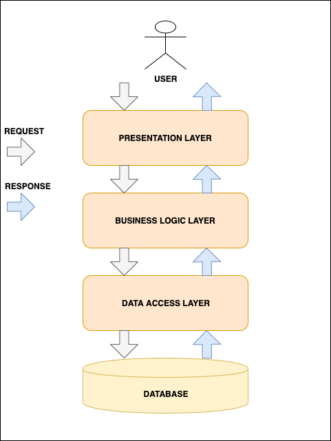

## Chatter Chain

A simple chat web application made with Java, Spring Boot, Thymeleaf and Spring Security OAuth2. When using the application, you can login with your Google or GitHub account and start chatting with other users. 

The application is deployed on [Railway](https://railway.app/), you can check it out [here](https://chatter-chain.up.railway.app).

The project is still in development. You can check the project status below.

## Requirements

- [Java 21](https://adoptium.net/)
- [Maven](https://maven.apache.org/)
- [Gradle](https://gradle.org/)

## Project Features

| Feature                                    | Status            |
|--------------------------------------------|-------------------|
| Consistent API design                      | 🟡 In development |
| Use of DTOs                                | 🟢 Ready          |
| Spring Security and OAuth2                 | 🟢 Ready          |
| Login with Google and GitHub               | 🟢 Ready          |
| Spring Data MongoDB                        | 🟢 Ready          |
| Layered architecture                       | 🟡 In development |
| Global Error Handling                      | 🟡 In development |
| API versioning                             | 🟢 Ready          |
| Logging with Log4j2                        | 🟡 In development |
| CI/ CD with Docker and Railway             | 🟢 Ready          |

## Architecture Layers

#### PRESENTATION LAYER

This layer is at the top of the architecture. This tier is responsible for:

✔️ Performing authentication.

✔️ Converting JSON data into an object (and vice versa).

✔️ Handling HTTP requests.

✔️ Transfering authentication to the business layer.

#### BUSINESS LAYER

The business layer is responsible for:

✔️ Performing validation.

✔️ Performing authorization.

✔️ Handling the business logic and rules.

#### PERSISTENCE LAYER

This layer is responsible for:

✔️ Containing storage logic.

✔️ Fetching objects and translating them into database rows (and vice versa).

#### DATABASE LAYER

This layer is simply the actual database that is responsible for:

✔️ Performing database operations (mainly CRUD operations).

## Software structure



## Getting Started

1. Clone the repository
2. Navigate to the project directory
3. Build the project using Maven:

```
./mvnw clean package -DskipTests
```

4. Run the project using Maven wrapper:

```
./mvnw spring-boot:run
```

## Usage

5. The application will start on http://localhost:8080, you can simply access it in your browser.

